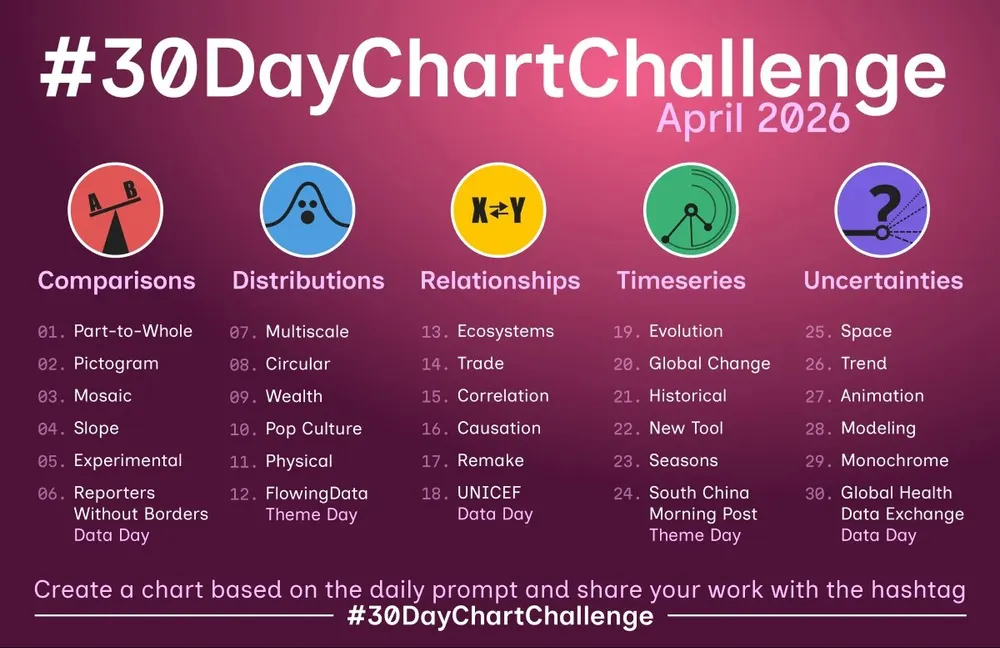

<p align="center">
  
</p>

# #30DayChartChallenge — April 2026

My take on the [#30DayChartChallenge](https://github.com/30DayChartChallenge), a community-driven data visualization challenge created by Cédric Scherer and Dominic Royé. One chart a day, every day in April — each inspired by a daily prompt.

I'm using **R** and **ggplot2** as my main tools, pulling data mostly from open global health, social, and environmental datasets. The goal: get better at telling stories with data, try chart types I've never touched before, and keep it fun.

---

## 👤 About Me

| Platform | Username                                                             |
| -------- | -------------------------------------------------------------------- |
| Bluesky  | [@yasar_sharfudeen](https://bsky.app/profile/newbie2k25.bsky.social) |
| Linkedin | [@yasar_arafath](https://www.linkedin.com/in/yasar-arafath-chemist/) |

---

## 📁 Repo Structure

```text
├── chart/        Final exported charts (PNG)
├── code/         R notebooks for each day
├── data/         Datasets used
├── image/        Challenge assets
├── README.md
└── LICENSE
```

---

## 📅 Challenge Progress

### ⚖️ Comparisons (Days 1–6)

| Day |  Date  | Prompt                                 | Chart        | Data                                                                                                                                                  | Status |
| :-: | :----: | :------------------------------------- | :----------- | :---------------------------------------------------------------------------------------------------------------------------------------------------- | :----: |
| 01  | Apr 01 | **Part-to-Whole**                      | Waffle Chart | [GBD 2021 — IHME](https://ghdx.healthdata.org/) · Global deaths by cause                                                                              |   ✅   |
| 02  | Apr 02 | **Pictogram**                          | Pictogram    | [WHO via WPR](https://worldpopulationreview.com/country-rankings/smoking-rates-by-country) · Smoking by gender                                        |   ✅   |
| 03  | Apr 03 | **Mosaic**                             | Mosaic       | [WHO GHE 2021](https://www.who.int/data/gho/data/themes/mortality-and-global-health-estimates/ghe-leading-causes-of-death) · Deaths by cause & income |   ✅   |
| 04  | Apr 04 | **Slope**                              | Slope        | [World Bank](https://data.worldbank.org/indicator/SH.PRV.SMOK) · Tobacco use 2010 vs 2022                                                             |   ✅   |
| 05  | Apr 05 | **Experimental**                       | Dumbbell     | [WHO via WPR](https://worldpopulationreview.com/country-rankings/smoking-rates-by-country) · Smoking gender gap                                       |   ✅   |
| 06  | Apr 06 | **Reporters Without Borders Data Day** | Bar Chart    | [RSF](https://rsf.org/en/index) · World Press Freedom Index 2025                                                                                      |   ✅   |

### 📊 Distributions (Days 7–12)

| Day |  Date  | Prompt                    | Chart       | Data                                                                                                         | Status |
| :-: | :----: | :------------------------ | :---------- | :----------------------------------------------------------------------------------------------------------- | :----: |
| 07  | Apr 07 | **Multiscale**            | Ridgeline   | [Global Carbon Project](https://github.com/owid/co2-data) · CO2 per capita by income                        |   ✅   |
| 08  | Apr 08 | **Circular**              | Polar Bar   | [IMD via data.gov.in](https://data.gov.in/catalog/rainfall-india) · Subdivision rainfall (4 regions)        |   ✅   |
| 09  | Apr 09 | **Wealth**                | Scatter     | [UBS Wealth Databook 2023](https://w.wiki/DRbm) · Median wealth per adult, 164 countries                    |   ✅   |
| 10  | Apr 10 | **Pop Culture**           | Raincloud   | [TVMaze API](https://www.tvmaze.com/api) · IMDb viewer ratings                                              |   ✅   |
| 11  | Apr 11 | **Physical**              | Circle Pack | [GEM 2024 (UNITAR/ITU)](https://globalewaste.org/map/) · E-waste generation, top 50                         |   ✅   |
| 12  | Apr 12 | **FlowingData Theme Day** | Stacked Bar | [GEM 2024 (UNITAR/ITU)](https://globalewaste.org/map/) · E-waste recycling gap, top 25                      |   ✅   |

### 🔗 Relationships (Days 13–18)

| Day |  Date  | Prompt              | Chart      | Data                                                                              | Status |
| :-: | :----: | :------------------ | :--------- | :-------------------------------------------------------------------------------- | :----: |
| 13  | Apr 13 | **Ecosystems**      | Dot Matrix | [World Bank / IUCN Red List](https://data.worldbank.org/) · Threatened species    |   ✅   |
| 14  | Apr 14 | **Trade**           | Bump Chart | [World Bank](https://data.worldbank.org/indicator/NE.EXP.GNFS.CD) · Top exporters |   ✅   |
| 15  | Apr 15 | **Correlation**     | Scatter    | [World Bank](https://data.worldbank.org/) · Env. stress vs life expectancy        |   ✅   |
| 16  | Apr 16 | **Causation**       | Area       | [UNEP via OWID](https://ourworldindata.org/ozone-layer) · ODS consumption         |   ✅   |
| 17  | Apr 17 | **Remake**          | Stripes    | [NASA GISTEMP v4](https://data.giss.nasa.gov/gistemp/) · Global temp 1880–2025    |   ✅   |
| 18  | Apr 18 | **UNICEF Data Day** | Choropleth | [UNICEF & Pure Earth](https://leadpollution.org) · Childhood lead exposure (BLL>5)|   ✅   |

### 🌐 Timeseries (Days 19–24)

| Day |  Date  | Prompt                                 | Chart | Data | Status |
| :-: | :----: | :------------------------------------- | :---- | :--- | :----: |
| 19  | Apr 19 | **Evolution**                          | Line  | [OWID](https://ourworldindata.org/grapher/global-plastics-production) · Plastics 1950–2019 |   ✅   |
| 20  | Apr 20 | **Global Change**                      | Connected scatter | [OWID](https://ourworldindata.org/grapher/solar-pv-prices) · Solar PV cost & capacity 2000–2024 |   ✅   |
| 21  | Apr 21 | **Historical**                         | Step chart | [NOAA/WDS Paleo](https://www.ncei.noaa.gov/access/metadata/landing-page/bin/iso?id=noaa-icecore-6177) · [McConnell & Edwards 2008, PNAS](https://doi.org/10.1073/pnas.0803564105) · Arctic Pb pollution 1772–2003 |   ✅   |
| 22  | Apr 22 | **New Tool**                           | Animated Line | [NOAA LSA](https://www.star.nesdis.noaa.gov/socd/lsa/SeaLevelRise/) · Global mean sea level 1993–2026 |   ✅   |
| 23  | Apr 23 | **Seasons**                            |       |      |   ⬜   |
| 24  | Apr 24 | **South China Morning Post Theme Day** |       |      |   ⬜   |

### ❓ Uncertainties (Days 25–30)

| Day |  Date  | Prompt                                   | Chart | Data | Status |
| :-: | :----: | :--------------------------------------- | :---- | :--- | :----: |
| 25  | Apr 25 | **Space**                                |       |      |   ⬜   |
| 26  | Apr 26 | **Trend**                                |       |      |   ⬜   |
| 27  | Apr 27 | **Animation**                            |       |      |   ⬜   |
| 28  | Apr 28 | **Modeling**                             |       |      |   ⬜   |
| 29  | Apr 29 | **Monochrome**                           |       |      |   ⬜   |
| 30  | Apr 30 | **Global Health Data Exchange Data Day** |       |      |   ⬜   |

> ⬜ Not started · 🟡 In progress · ✅ Done

---

## 🛠️ Tools

- **R** with `ggplot2`, `dplyr`, `tidyr`, `showtext`
- Fonts from [Google Fonts](https://fonts.google.com/)
- Chart inspiration from [From Data to Viz](https://www.data-to-viz.com/) and [The R Graph Gallery](https://r-graph-gallery.com/)

---

## 📜 License

[MIT](LICENSE)
